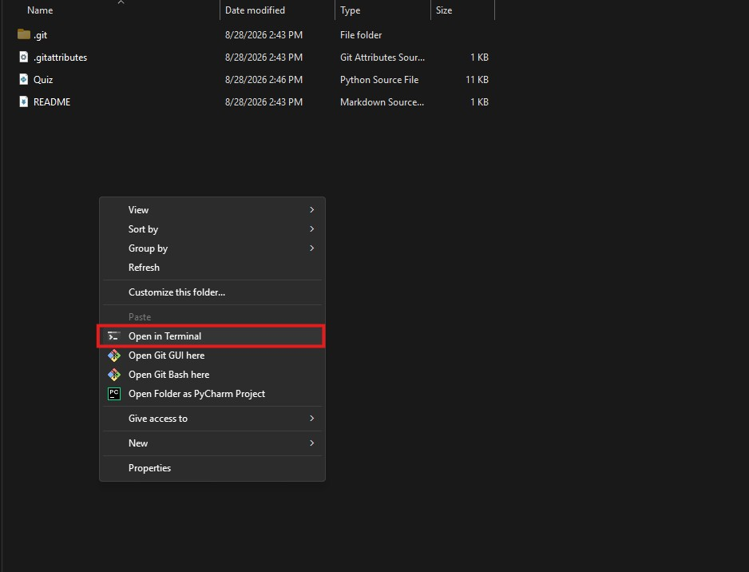
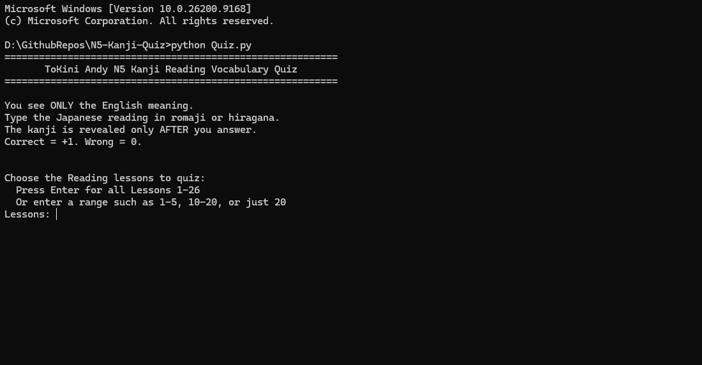
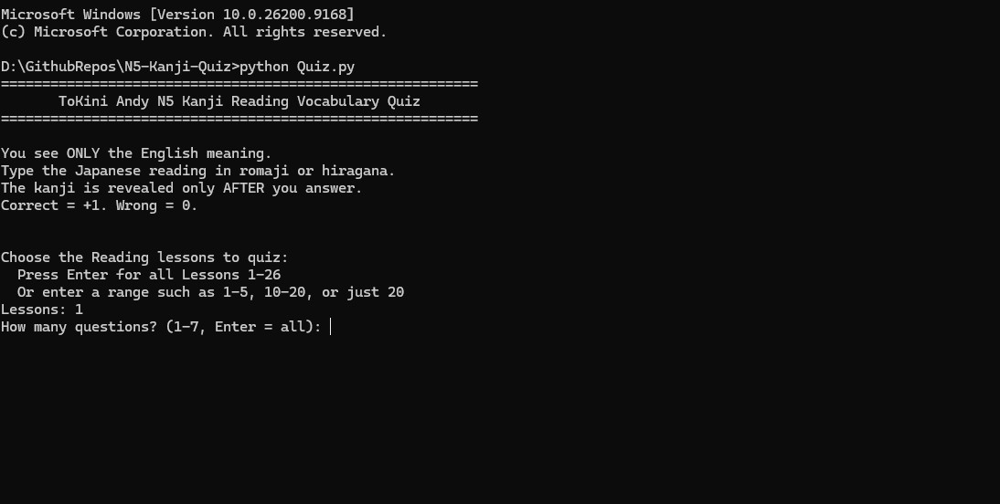
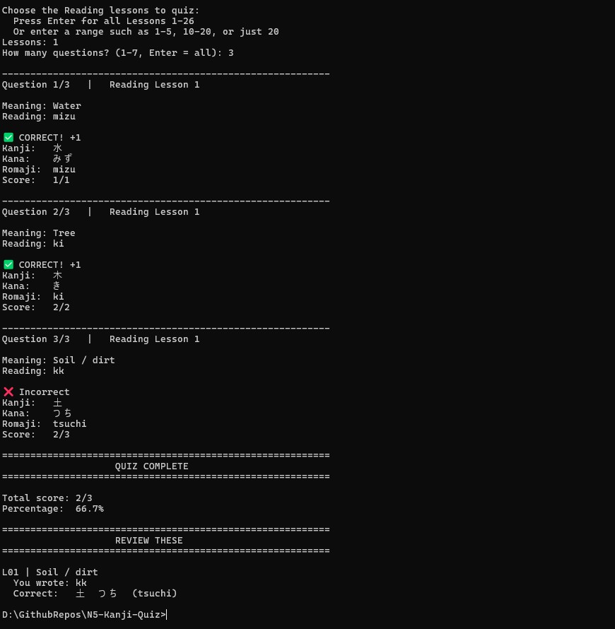

# ToKini Andy N5 Kanji Reading Quiz

A simple command-line quiz for practicing Japanese kanji readings and vocabulary from the **ToKini Andy N5 Kanji Reading series**.

The quiz shows you **only the English meaning** first. You type the Japanese reading in **romaji or hiragana**, and the kanji is revealed after you answer.

- Correct answer: **+1 point**
- Wrong answer: **0 points**
- Questions are randomized
- You can choose one lesson, a lesson range, or all lessons
- You can choose how many questions you want
- At the end, the app shows your total score and the words you should review

> This is an unofficial fan-made study tool and is not affiliated with ToKini Andy.

---

## Run on Windows without Python

If you only want to use the quiz and do not want to install Python, download:
[⬇️ Download Quiz.exe](https://github.com/RexMello/N5-Kanji-Quiz/releases/latest/download/Quiz.exe)

```text
Quiz.exe
```

Then double-click `Quiz.exe` to start the quiz.

If the executable is provided through GitHub Releases, open the **Releases** section of this repository and download the latest `Quiz.exe`.

> Windows may display a security warning for executables downloaded from the internet. Only run files you trust.

---

## Run from the Python source code

### 1. Install Python 3.9

Download Python 3.9.0 from the official Python website:

https://www.python.org/downloads/release/python-390/

On Windows, download the appropriate installer and run it.

During installation, it is recommended to enable:

```text
Add Python 3.9 to PATH
```

### 2. Download the project

You can either clone the repository:

```bash
git clone <your-repository-url>
```

or use GitHub's **Code -> Download ZIP** option and extract the downloaded ZIP file.

### 3. Open a terminal in the project folder

On Windows, open the folder containing `Quiz.py`, right-click inside the folder, and select:

```text
Open in Terminal
```



### 4. Run the quiz

Run:

```bash
python Quiz.py
```

If Windows does not recognize the `python` command, try:

```bash
py -3.9 Quiz.py
```

The quiz uses Python's standard library, so no additional `pip install` commands are required.

---

## How the quiz works

### Choose the Reading lessons

When the program starts, you can choose which ToKini Andy Reading lessons you want to practice.

Press **Enter** to use all lessons, enter one lesson such as:

```text
20
```

or enter a range:

```text
1-5
```



### Choose the number of questions

After selecting the lessons, the program tells you how many vocabulary words are available.

Enter the number of questions you want, or press **Enter** to practice all available words.



### Answer the reading

For each question, the program initially shows only the English meaning:

```text
Meaning: Water
Reading: mizu
```

After you submit your answer, the program reveals the kanji, kana, and romaji:

```text
CORRECT! +1
Kanji:  水
Kana:   みず
Romaji: mizu
Score:  1/1
```

If your answer is wrong, you receive no point and the correct reading is shown.

At the end of the quiz, the program displays:

- Your total score
- Your percentage
- Every word you answered incorrectly
- The correct kanji, kana, and romaji for those words



---

## Example

```text
Question 1/3

Meaning: Water
Reading: mizu

CORRECT! +1
Kanji:  水
Kana:   みず
Romaji: mizu
Score:  1/1
```

A compound word can appear in exactly the same way:

```text
Meaning: Entrance
Reading: iriguchi

CORRECT! +1
Kanji:  入口
Kana:   いりぐち
Romaji: iriguchi
```

The kanji is intentionally hidden until after you answer, so you are recalling the Japanese reading from the English meaning rather than reading the kanji itself.

---

## Project files

```text
N5-Kanji-Quiz/
|-- Quiz.py
|-- Quiz.exe
|-- README.md
`-- screenshots/
    |-- 01-open-terminal.jpg
    |-- 02-choose-lessons.jpg
    |-- 03-choose-question-count.jpg
    `-- 04-quiz-results.jpg
```

`Quiz.exe` is only required if you want to distribute the compiled Windows version. Python users can run `Quiz.py` directly.

---

## Requirements

For the executable version:

- Windows

For the source-code version:

- Python 3.9
- Windows, Linux, or macOS with a compatible Python installation

---

## Credits

The study vocabulary and lesson structure are based on the **ToKini Andy N5 Kanji Reading series**.

If you find the quiz useful, consider supporting ToKini Andy and following the original lessons alongside the quiz.
